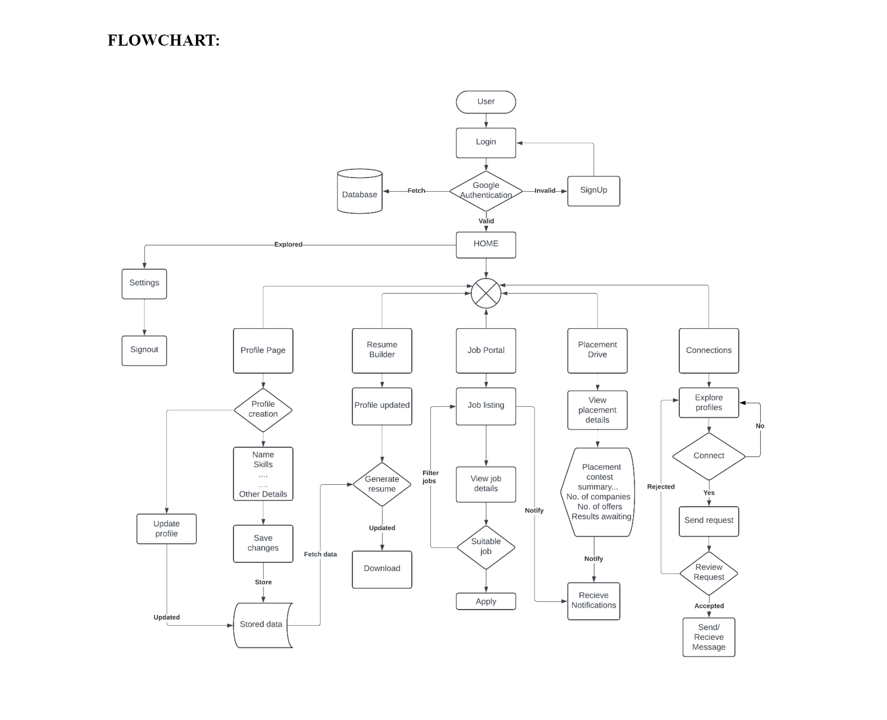

# BIT_LinkedIn_Portal

The project aims to develop a LinkedIn-like portal specifically tailored for a college environment, focusing on connecting students, facilitating communication, aiding in job searches, and providing resources for career development.

## Workflow

## Features
- Connecting students
- Facilitating communication
- Aiding in job searches
- Providing career development resources
